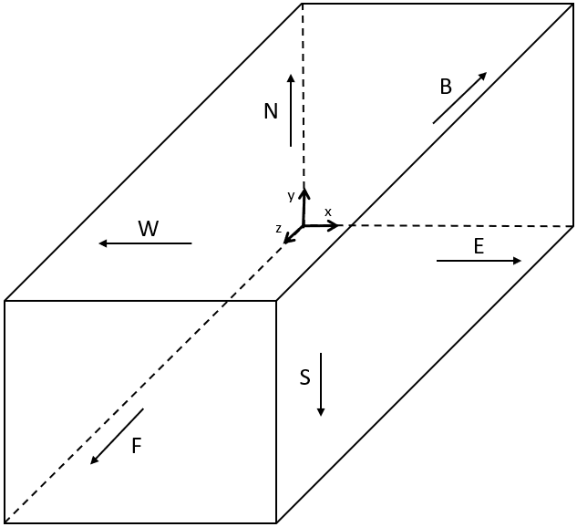

# Instructions to update code

## Changing simulation parameters

_[var.h](../src/CUDA/var.h)_
* To change precision (single or double) and velocity set used, alter the field `PRECISION AND VEL. SET DEFINES`.
* To change output options, as intervals between saving macroscopics, the ID (identification), output folder path, etc. alter the field `OUTPUT DEFINES`.
* To change the data treatment, its frequency, use it as stop condition, save it, etc. alter the field `DATA TREATMENT DEFINES`. 
* To change the initialization mode, alter the field `INITIALIZATION LOADING DEFINES`.
* To change LBM parameters, as tau, lattice size, pressure and velocity values for boundary conditions, etc. alter the field `SIMULATION DEFINES`.

## Changing boundary conditions

1. Select a template in _CUDA/boundaryConditionsBuilder/_ and copy it to the same folder. Rename it with the name of the boundary conditions that will be implemented.
2. Alter the functions `gpuBuildBoundaryConditions()` in the file copied to change the boundary conditions to the desired ones, following the template examples.
3. If any boundary condition not implemented is required, the nodes using it must be classified as `BC_SCHEME_SPECIAL` and the function `gpuSchSpecial()` must be updated to treat the special case.
4. Copy the file to the folder with the _[main.cu](../src/CUDA/main.cu)_. Remove any other boundary condition implementation from the folder _CUDA/_.

**Figure 1** - conversion from directions (north, south, east, west, front, back) to axis (x, y, z).

Observations: 
* The file _[nodeTypemap.h](../src/CUDA/structs/nodeTypeMap.h)_ contains the boundary conditions schemes (Zou-He, bounce back, free slip, etc.). The folder _CUDA/boundaryConditionsSchemes/_ contains its implementation. It should be noticed that not all schemes are available for D3Q27 nor all the combinations of schemes and directions (e.g. Zou-He is not available for edges or corners).
* Check compatibility between the boundary conditions scheme used and the collision operator (e.g. Zou-He implemented is not suitable for collision with force term).
* Do not forget to change the author name in the file before upload or share it.
* No case validation is guaranteed. Check it with the author if required.

## Changing collision

_[lbm.cu](../src/CUDA/treatData.cu)_
* The folder _CUDA/collisionSchemes/_ has the implementation for collision schemes. Copy and paste the content of the file with the desired collision to the function `gpuBCMacrCollisionStream()`, between the macroscopics saving (after `if(save){...}`) and the streaming.
* Compatibility between the boundary conditions and the collision must be checked (e.g. Zou-He not compatible with force).

## Changing initialization

_[lbmInitialization.cu](../src/CUDA/lbmInitialization.cu)_
* Update `gpuMacrInitValue()` to change initial macroscopics.
* Update `gpuInitialization()` to change initialization (default is equillibrium populations).

_[var.h](../src/CUDA/var.h)_
* Change initialization mode to load macroscopics or populations from file.

## Changing data treatment

_[macrProc.h](../src/CUDA/structs/macrProc.h)_
* Update `macrProc` struct, adding or deleting required treated variables.
* Update `macrProc` constructor and destructor (`macrProc()` and `~macrProc()`). 

_[treatData.cpp](../src/CUDA/treatData.cpp)_
* Update `treatData()` to alter treatment of macroscopics data.
* Update `printTreatData()` to alter the print of treated date.
* Update `stopSim()` to alter the conditions to stop simulation by treated data.
* Update `saveTreatData()` to alter the data to be saved.

## Adding macroscopic

_[macroscopics.h](../src/CUDA/structs/macroscopics.h)_
* Update constructor and desctructor (`macroscopics()`, `~macroscopics()`).
* Update memory allocation and deallocation, if the macroscopic is an array (`macrAllocation()`, `macrFree()`).
* Update `copyMacr()`.

_[lbm.cu](../src/CUDA/lbm.cu)_
* Update LBM bulk (`gpuBCMacrCollisionStream()` and `gpuUpdateMacr()`).

_[lbmInitialization.cu](../src/CUDA/lbmInitialization.cu)_
* Update LBM initalization (`gpuMacrInitValue()` and `gpuInitialization()`).

_[lbmReport.cpp](../src/CUDA/lbmReport.cpp)_
* Update saving functions (`saveMacrBin()`).

_[main.cu](../src/CUDA/main.cu)_
* If loading macroscopics from file is required, update where `LOAD_MACR` is.

_[var.h](../src/CUDA/var.h)_
* If loading macroscopics from file is required, update macroscopics file names to be loaded.
